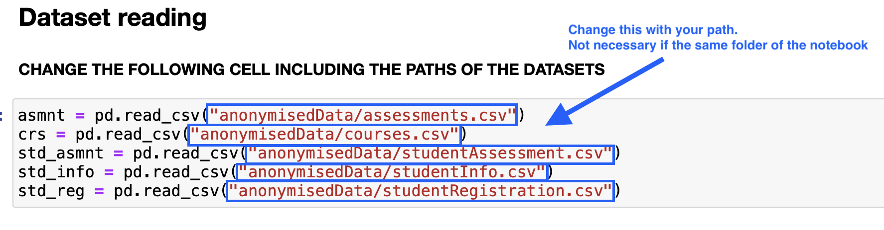

# The role of demographics in online learning; A decision tree based approach

### The aim of the following notebook is to reproduce the results obtained by Saman Rizvi, Bart Rienties and Shakeel Ahmed Khoja in section 4.1 of [their paper](https://www.sciencedirect.com/science/article/abs/pii/S0360131519300818?via%3Dihub).

### While Rizvi, Rienties and Khoja used R programming language and its rpart( ) package for decision tree model implementation, in this work has been used Python programming language and [ScikitLearn](https://scikit-learn.org/stable/).

### Dataset: [OULAD](https://analyse.kmi.open.ac.uk/open_dataset)

### How to run:
Visit [OULAD](https://analyse.kmi.open.ac.uk/open_dataset) and download the dataset.
Change datasets path in the notebook if necessary. This should not be required if you just move the downloaded dataset in the notebook directory.

Just run.

#### A very short review of the paper

Rizvi et al. research was not the first work to prove the impact of student's individual characteristics on their learning outcomes, but has been one of the fewest that considered learning outcomes related to the course progression. 

By looking at the [OULAD dataset documentation](https://analyse.kmi.open.ac.uk/open_dataset#description) we can see that progression is represented by date_submitted attribute in studentAssessment table.

With their work they proved not only that individual learner's characteristics impact on their learning outcomes but also that the impact of each individual characteristics changes over time! 

So now we could be interested in which individual characteristic impacts more on learning outcomes (on avarage, since we are considering these as time goes on).

Now the only thing left to explain is which demographics characteristic Rizvi et al. used for their work?
- gender
- age band
- region
- [imd band](https://en.wikipedia.org/wiki/Multiple_deprivation_index)
- disability
- education level

The development of models were divided in two phases. The aim of this project is to reproduce the development of models related to Phase 1.
##### Phase 1
Develop six predictive models:
- S1,...,S5 for each **TMA (Teacher Marked Assignment)**, *Sx is related TMAx ( i=1,___,5 )* 
- S6 for the **final result**

Consider that time progression is represented in TMAs by date attribute in assessment table; in their work (and consequently in this) progession in time is represented by model's name enumeration:
*TMA1 is the first Teacher Marked Assignment, TMA5 in the last Teacher Marked Assignment*.

**Phase 1 was applied over learners of course A (2013 module), who attempted all TMAs, final exam and never unregistered from the course (grand total of 289 learners)**.

Learning outcomes are represented by three distinct values:

| Label       | Related score |
| ----------- | -----------   |
| Fail        | < 55          |
| Pass        | >= 55         |
| Distinction | >= 85         |

## Highlighting results

As depicted in barplots and in the previous graph, we can see that the **impact of each variable on learning outcomes changes over time**. We are now interested in the importance on average. 

By our experiments it turns out that, in decresing order, **the most important variables are**:
- region
- imd band
- highest education
- age band
- gender
- disability


## NOTES:
### LabelEncoder:
Is a function used to encode target values in numerical values in a range.

If an attribute **X** has a not numerical domain **Dom(X)** with cardinality **N** a label encoding applied to **X** will transform **Dom(X)** to {0,...,N-1}.

This has been done because ScikitLearn implementation of decision trees doesn't support not numerical values in X set. However it supports not numerical in y set.

To apply this operation we also came accross OneHotEncoding(). Here is why we didn't used it:

*For simplicity imagine now that imd_band domain contains only three values: Ireland (I), London(L), Wales(W)*.

Consider we are trying to convert *imd_band* values into numerical using *OneHotEncoding*. 
What *OneHotEncoding* does is to create three distinct new *dummy variables* (and so attributes). *Each object* now will have these three new dummy variables indicating if the object itself has *that variable true or false (0,1)*. So if now we will try to *compute variable importance*, we will not have a single variable importance for the variable *imd_band* but instead we will compute the single importances of living in Ireland(I), London(L), Wales(S); this is not what we want.

What happens using LabelEncoder: 
   - imagine Dom(imd_band) = {I,L,W}
   - imagine encoding as I->0, L->1, W->2
    
| id_student  | imd_band      |
| ----------- | -----------   |
| id_a        | 0             |
| id_b        | 2             |
| id_c        | 1             |


What happened using OneHotEncoding: 
   - imagine Dom(imd_band) = {I,L,W}
   - imagine encoding as I->0, L->1, W->2
 
    
| id_student  | is_I          | is_L        | is_W        |
| ----------- | -----------   | ---------   | ---------   |
| id_a        | 1             | 0           | 0           |
| id_b        | 0             | 0           | 1           |
| id_c        | 0             | 1           | 0           |


### Cross Validation
Looking at the PredictiveTMA class you will see two different *get_tree(self)* functions, one of which is commented. We decided to leave that one commented to emphisize what we are going to say.

```
def get_tree(self,rnd) -> DecisionTreeClassifier:
    self.tree = DecisionTreeClassifier(random_state=rnd)
    self.tree.fit(self.X_train,self.y_train) 
    return tree
```
With this snippet of code we are just creating and fitting a Decision Tree.

When using this function to create a *Decision Tree* we just gave to the Tree an *uncertainity on how it will select the sample: random_state=rnd* if *rnd is an integer* it will be used as a *seed to generate random samples*. If we use a *fixed integer for rnd*, we will be sure that every time it will pick the same sammples; this is actually good because we are going to generate six distinct models!

However if we decide that *random_state=None* what happens is that it will produce diffent instances. Buy running the function using *random_state=None*, we arrived to different result with respect to those obtained with a fixed integer random_state. 
What we noticed is that sometimes we obtained same results of Rizvi et al. (when region is the most important variable while other times imd_band was the most one). Maybe there was something we didn't consider in our approach.

It turns out that rpart() package used by Rizvi et al. uses k-fold cross validation.
This is why we used GridSearchCV and builded the Decision Trees using the best estimator (Rizvi et al. didn't specfied the k value of cross validation, we used 5 because is very common).

```
def get_tree(self,rnd):
        param_grid = {'random_state':[rnd]}
        clf = GridSearchCV(DecisionTreeClassifier(),param_grid,cv=5)
        clf.fit(self.X, self.y)
        clf = clf.best_estimator_
        self.tree = clf
        return self.tree
```
With this new *get_tree* function we now started to obtain the same result of Rizvi et al.

